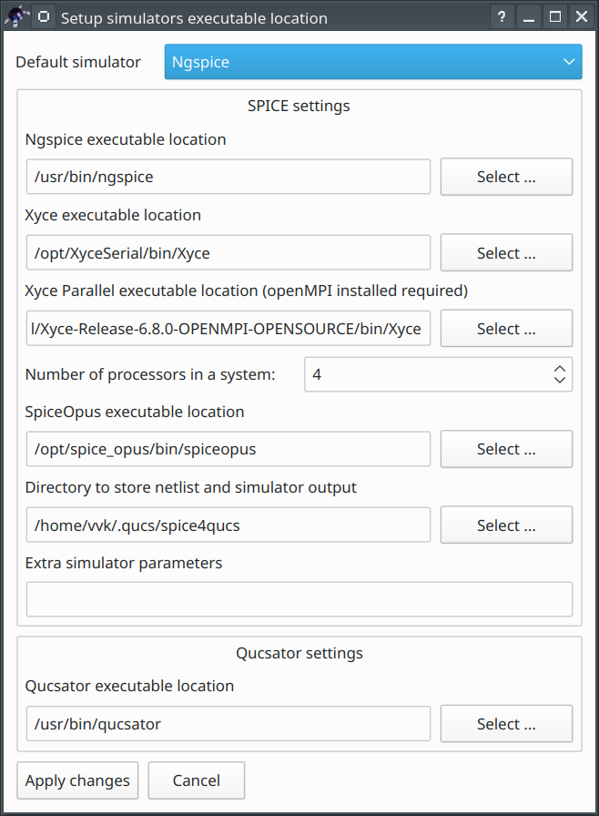
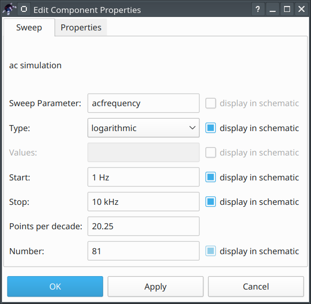

= Qucs-S: Getting started analog simulation
Vadim Kuznetsov
:stem: latexmath

[[sec:intro]]
== Introduction

Qucs-S was forked from the Qucs cross-platform circuit simulator in
2017. "S" letter indicates SPICE. The purpose of the Qucs-S subproject
is to use free SPICE circuit simulation kernels with the Qucs GUI. It
merges the power of SPICE and the simplicity of the Qucs GUI. Qucs
intentionally uses its own SPICE incompatible simulation kernel
Qucsator. It has advanced RF and AC domain simulation features, but most
of the existing industrial SPICE models are incompatible with it. Qucs-S
is not a simulator by itself, but requires to use a simulation backend
with it. The schematic document format of Qucs and Qucs-S are fully
compatible. Qucs-S allows to use the following simulation kernels with
it:

* Ngspice is recommended to use. Ngspice is powerful
mixed-level/mixed-signal circuit simulator. The most of industrial SPICE
models are compatible with Ngspice. It has an excellent performance for
time-domain simulation of switching circuits and powerful postprocessor.
* XYCE is a new SPICE-compatible circuit simulator written by Sandia
from the scratch.
* SpiceOpus is developed by the Faculty of Electrical Engineering of the
Ljubljana University. It based on the SPICE-3f5 code.
* Qucsator as backward compatible and for RF simulation with microwave
devices and microstrip lines. Not recommended for general purpose
circuits.

Qucs-S is a cross-platform software and supports a number of Linux
distributions alongside with Windows. The Linux packages are generated
automatically with the Open Build Service (OBS ) system. Check the
official website to get the list of supported distributions. Please keep
in mind that the installation packages doesn’t provide the simulation
kernel. It need to be installed separately. The Ngspice is recommended.
For Debian and Ubuntu it is installed automatically as the dependency.
Refer to Ngspice website for installation instructions for other
platforms.

== Setup on the first start

Once the Qucs-S is installed, it asks to select the simulation kernel.
Since the version 2.0.0 the application tries to find Ngspice in some
usual system locations on the first start. If the Ngspice executable was
found automatically the information message will be shown. Otherwise the
user will be prompted to configure the simulators manually. The
following window (Fig. #fig:sim_setup[1]) is opened after the first
start of the application. Select the default simulator using the
drop-down list and correct the simulator executable paths if necessary.
These settings could be corrected later using the
_Simulation_`+->+`_Select default simulator_ menu.

Quick switching of the simulation kernel without application restart is
supported since version 2.0.0. See the section #sec:quick_sw[9] for more
details.

== Main window structure

The Qucs-S main window is shown in the Fig. #fig:mainwin[2]. The main
window consists of two areas: schematic editor (4) on the right side and
main dock (1) on the left side. Several schematics could be opened
simultaneously. It’s possible to switch between the opened schematics
using the tabular bar above the schematic editor area.

image::img/mainwin.png[Qucs-S main window. See text for explanations]

The dock on the left side has four tabs (3): _Projects_, _Content_,
_Components_, and _Libraries_. The _Projects_ tab is opened after the
application start. It is empty, because there is no projects after the
fresh installation. The _Components_ tab (see Fig. #fig:mainwin[2])
contains a list of primitive devices available in Qucs. The components
are divided into several categories (lumped devices, nonlinear devices,
simulation, etc.). The categories could be selected from the drop-down
list (2). The status bar is located on the bottom side of the main
window. The active simulation kernel is displayed on the status bar (for
example Ngspice on Fig.#fig:mainwin[2]).

The toolbar area is located on the top side of the main window below the
main menu. Some important buttons are located on the toolbar. They are:
_Wire_ (6), _Node name_ (7), _Ground_ (8), and _Marker_ (9).

Everything in Qucs-S is considered to be a component. The simulations,
equations, and SPICE directives are also special components that could
be found in dedicated categories in the component pallet. The diagrams
are also special components and could be found in the _diagrams_
category in the drop-down list (2).

To place the component on schematic choose desired category from the
drop-down list (2) (for example "lumped components") and click on the
symbol (for example "Resistor"). Moving the mouse cursor into the
working area (4) you are carrying a drawing of a resistor symbol.
Pressing the right mouse button rotates the symbol, pressing the left
mouse button places the component onto the schematic.

The components properties could be edited using the properties dialog
(Fig. #fig:prop_dlg[3]) that is called from the context menu of the
component or after the left mouse button double click.

image::img/prop_dlg.png[Component properties dialog,scaledwidth=45.0%]

== Step by step guide how to setup an analog simulation

=== AC and transient simulation

Let’s simulated an RC-circuit using Qucs-S with Ngspice backend. The
schematic is shown in the Fig. #fig:rc[4]. Let’s perform the AC and
transient simulations and plot the magnitude response of the circuit and
the waveforms on the input and output nodes. Perform the following steps
to draw the schematic and setup the simulation.

image::img/rc.png[RC-circuit in Qucs-S]

* *Step 1:* place components on the schematic and set their properties
as show in the Fig. #fig:rc[4]. We need resitor, capacitor (both could
be found in the _lumped devices_ category) and AC voltage source (from
_sources_ category). The ground and wires could be taken from the
application tool bar (see Fig. #fig:mainwin[2]) using the buttons (6)
and (8).
* *Step 2:* place simulations on the schematic. We need AC simulation
and Transient simulation. Both could be taken from the _simulations_
category (see Fig. #fig:rc[4]). The procedure is same as for usual
components. Setup the properties of the simulations as shown in the Fig.
#fig:rc[4]. A special dialog window opens upon the double click on the
simulation device (Fig. #fig:dlg_sim[5]). For AC simulation enter the
start (1 Hz) and stop (10 kHz) frequencies and select the logarithmic
sweep type. For transient simulation enter the stop time (2 ms) and
points number (200 points).
+

* *Step 3:* place the node labels `+in+` and `+out+` using the button
(6) on the toolbar (see Fig. #fig:mainwin[2]). The node name could be
set in a special dialog window (Fig. #fig:nod_lbl[6]).
+
image::img/nod_lbl.png[Node label setup dialog,scaledwidth=40.0%]
* *Step 4:* Place equation for the magnitude response
latexmath:[K=V_{out}/V_{in}] on the schematic. Equation is the special
component called _Nutmeg equation_ that could be found in the _spice
specific sections_ category. The full SPICE syntax for mathematical
functions and node names is supported. Refer to Ngspice manual for more
details. The simulation should be specified for each Nutmeg equation. We
will calculate the magnitude response for the AC simulation only and
therefore we need to enter `+ac+` as the first property for this device
as shown on the Fig. #fig:eq[7].
+
image::img/nutmeg_eq.png[Equation setup dialog,scaledwidth=40.0%]
* *Step 5:* Save the schematic document as the file with the `+*.sch+`
extension using the _File_ `+->+` _Save as_ menu or press the `+Ctrl-S+`
shortcut. The schematic is ready for the simulation now.
* *Step 6:* simulate the schematic. Press the _Simulation_ `+->+`
_Simulate_ or press the F2 hotkey on the keyboard. The dialog window
containing the simulator log messages will appear shortly (Fig.
#fig:sim_dlg[8]). This dialog window contains the simulation console
where the messages from the Ngspice are shown.
+
It should report that the simulation finished without errors. If you see
error messages check your schematic and application settings. After the
Ngspice reports about the finished simulation, close this window
clicking the _Exit_ button. Now the diagrams could be added on schematic
field. It is also possible to save the netlist file from this dialog .
+
image::img/sim_dlg.png[Simulation dialog,scaledwidth=40.0%]
* *Step 7:* place diagrams on the schematic (Fig. #fig:rc_dpl[9]). We
need two cartesian diagrams for magnitude response and transient
waveforms. The diagrams are also special components that could be found
in the _diagrams_ category. The traces could be selected in the special
diagram properties dialog (Fig. #fig:diagr_dlg[10]). Select the `+ac.k+`
traces for one diagram and `+tran.v(in)+` and `+tran.v(out)+` traces for
another diagram. It is also possible to setup the axis limits and type
and the color scheme for the diagram. Select logarithmic X-axis for the
magnitude response graph using the settings in the _Properties_ tab. The
markers could be placed on graphs using the button (9) from the toolbar
(Fig. #fig:mainwin[2]). The position of the marker could be adjiusted
using the arrow keys on the keyboard.
+
image::img/rc_dpl.png[Schematic with two diagrams added]
+
image::img/diagr_dlg.png[Diagram properties dialog,scaledwidth=40.0%]

[[sec:dc]]
=== DC analysis

Qucs-S unlike Qucs has no special DC simulation mode. If only _DC
simulation_ component is placed on the schematic no simulation will be
launched and error message will be shown. This component is kept for
backward compatibility with old Qucs schematics.

But there exists two modes of the DC simulation:

* Show operating point directly on the circuit. This mode is activted
when pressing F8 keyboard shortcut or using _Simulation->Show bias_ menu
entry. See the Fig. #fig:rdiv_f8[11] for example of such simulation.
* DC sweep mode. You need to insert _Parameter sweep_ simulation
component and attach it to the DC simulation. This simulation mode could
be used for plotting IV-curves or getting table output. See the Fig.
#fig:rdiv_dc[12] for example of this simulation.

image::img/rdiv_f8.png[Operating point simulation of the voltage
divider,scaledwidth=80.0%]

image::img/rdiv_dc.png[Using DC sweep to get table output of the
resistive divider voltage,scaledwidth=80.0%]

== Parameter sweep

=== Device sweep

Parameter sweep is defined as the special simulation type that is
attached to any other simulation. Let’s consider an example and attach
parameter sweep to the circuit shown in the Figure #fig:rc[4]. We will
see the influence of the resistance of the RC-circuit on the cutoff
frequency.

*Important note:* unlike Qucs before version 0.0.20, Qucs-S doesn’t
support the sweep of variables directly. Legacy Qucs schematics using
variable sweep will not work. Parameter sweep supports only device
sweep. Resistor, capacitor or source are accepted.

Perform the following steps to add parameter sweep:

* *Step 1:* Place parameter sweep component on the schematic sheet
(Figure #fig:rc_parsw[13]). The _Parameter sweep_ device could be found
in the _simulations_ group.
+
image::img/rc_parsw.png[Adding parameter sweep on the
schematic,scaledwidth=80.0%]
* *Step 2:* Set the properties of the parameter sweep simulation. After
the double click the dialog window will be opened (Figure
#fig:parsw[14]). The _Simulation_ drop-down list is the the name of
simulation component to which the parameter sweep is attached. For our
example we need to select the `+AC1+` simulation from the drop-down
list, because we attaching the parameter sweep to the AC simulation. The
_Sweep parameter_ input field is the *device* name. Variables or other
objects name are not acceptable here! Enter the `+R1+` device name here.
The _Start_, _Stop_, _Step_, and _Number_ input fields serve for the
definition of the sweep range. We will sweep the `+R1+` value from 1
kOhm to 5 kOhm and take 4 sweep points.
+
image::img/parsw_dlg.png[Setting parameter sweep
properties,scaledwidth=50.0%]
* *Step 3:* Run the simulation and place the diagrams as for usual
simulation (Figure #fig:parsw_mr[15]). You should see the family of the
curves. You may place a marker on the diagram and move it between the
sweep curves with _Arrow Up_ and _Arrow Down_ keys.
+
image::img/parsw_mr.png[Magnitude response of the RC-circuit with the
parameter sweep,scaledwidth=80.0%]

=== DC sweep

DC sweep simulation takes place when parameter sweep is attached to the
DC simulation. Such simulation mode is explained in the Section
#sec:dc[4.2]. DC sweep only accepts device name (resistor or source) as
the sweep parameter name. The DC sweep with variable name will not work.
This simulation mode usually serves for obtaining the IV-curves.

=== Variable sweep

The recent version of the Ngspice support sweeping of the varibles. The
variable should be defined using the `+.PARAM+` statement (available at
the _SPICE specific sections_ group). Qucs-S doesn’t create the variable
automatically. Refer to the schematic shown in the Figure
#fig:rc_parsw_var[16] for the example of such simulation mode.

image::img/rc_parsw_var.png[Magnitude response of the RC-circuit with
the parameter sweep,scaledwidth=80.0%]

== Digital simulation

=== Digital devices with analog model

Digital devices including logic gates, flip-flops, and more complex
devices could be found in the group _Digital components_. Some of these
devices have both analog and digital model. Ngspice simulation operates
using XSPICE models. Here is the list of these devices:

* Logic gates, inverter and buffer
* D-, JK-, T-flip-flops
* Digital source

The usage of these devices in analog simulation mode has no special
requirements. The example shown in the Figure #fig:logic_gen[17]
illustrates the transient simulation of the RC oscillator circuit
containing two inverter logic gates. The power supply voltage for
digital devices should be set using the `+VCC+` parameter with
`+.PARAM+` section.

image::img/logic_gen.png[Oscillator example using logic
gates,scaledwidth=80.0%]

[[sec:digi]]
=== Digital simulation with Verilog/VHDL

The most of digital components except of the listed in the previous
section doesn’t contain analog SPICE model. These devices are supported
by digital simulation mode only. *Mixing digital and analog devices
(like RCL) in one circuit is not supported!* You need to install one the
following free backends to perform digital simulation

* Icarus Verilog `+iverilog+` https://steveicarus.github.io/iverilog/
* FreeHDL http://freehdl.seul.org/

Place on the schematic field a special device named _Digital simulation_
to switch Qucs-S to digital mode. Verilog or VHDL backend will be
started automatically instead of SPICE if digital simulation is found in
the schematic. User doesn’t need to switch Qucs-S to the digital mode in
the application settings.

There are two modes of the digital simulation: truth table and timing
diagram. An example of the digital simulation of the 2-bit
decoder/demultiplexer is shown in the Figure #fig:demux[18]. This
simulation uses Verilog and timing diagram mode.

image::img/demux.png[Simulation of the digital circuit with
iverilog,scaledwidth=80.0%]

== Tuning mode

Since the version v2.1.0 Qucs-S support the tuning simulation mode. The
tuner allows to adjust the component property values using an
interactive sliders and immediately see the result on diagrams. Tuning
mode is supported for all simulation kernels including Ngspice and
Qucsator. Tuner may act as an interactive alternative of the parameter
sweep simulation.

Let’s consider how to use the tuning mode for the RC-circuit Fig.
#fig:rc[4]. The schematic is required to have the simulations and
diagrams placed on schematic. The tuner will not work without defined
simulations and diagrams. The tuner is activated using the
_Simulation->Tune_ menu or F3 keyboard shortcut. The following dialog
window (Fig. #fig:tuner_dlg[19]) is shown after the activation. Then
user need to click on the device or the device property with the left
mouse button. A new slider will be added to the tuner window. It is
possible to manually set the upper and lower limit of the tuned device
property. The default limits are within the latexmath:[\pm15\%] range
from the starting value.

image::img/tuner_dlg.png[Tuner dialog window,scaledwidth=30.0%]

After the sliders are added to the tuner window it is possible to drag
the sliders and observe the changes on the diagrams. For example we can
see the cutoff frequency of the RC-circuit is increasing when C is
decreasing. If the tuner window is closed the user will be prompted to
update or revert the components values on schematic.

image::img/tuner_rc.png[Tuning of the RC-circuit]

== RF simulation

=== Common notes on RF circuits analysis

RF circuits are often described by the scattering matrix (S-parameters).
Many electrical properties of networks of components (inductors,
capacitors, resistors) may be expressed using S-parameters, such as
gain, return loss, voltage standing wave ratio (VSWR), reflection
coefficient and amplifier stability. It is possible to convert the
S-parameters to the Y or Z-matrix to estimate the input and output
impedances of the circuit.

The S-parameters of the two-port circuit have the following meaning:

* latexmath:[S_{11}=\Gamma_1] input reflection coefficient; if
latexmath:[S_{11}=0] the circuit is ideally matched without reflection;
* latexmath:[S_{21}] forward power gain latexmath:[G_p] from input (port
1) to output (port 2). For passive circuits always latexmath:[G_p<1];
* latexmath:[S_{12}] reverse power gain from output to input.
* latexmath:[S_{22}=\Gamma_2] output reflection coefficient;

The VSWR and reflection coefficients are related as the following:

[latexmath]
++++
\mathrm{VSWR} = \frac{1+|\Gamma|}{1-|\Gamma|}
++++

=== RF simulation with Ngspice

Ngspice supports the S-parameter simulation since the version 37. Make
sure that your Ngspice package has the version above 37. Otherwise this
simulation mode will not work. There exists a special S-parameter
simulation component that should be placed on schematic. The input and
output ports of the circuit are represented by _power source_ component
(Fig. #fig:port50[21]).

image::img/port50.png[The power source representing 50-ohm
port,scaledwidth=20.0%]

The parameters of this device are port number `+Num+`, frequency
latexmath:[f], and source power latexmath:[P] expressed in dBm. Two such
sources should be connected to schematic input and output nodes
respectively.

Let’s consider an example and simulate the frequency response of the
bandpass filter for the 20m hamradio band. The schematic is shown in the
Fig. #fig:filt20m[22].

image::img/filt20sim.png[The simulation of the band-pass filter with
Qucs-S and Ngspice]

The filter consists of LC-devices that could be found in the _lumped
devices_ group. The filter schematic contains two 50-ohm port sources
connected to its input and output nodes (`+in+` and `+out+`). The
_S-parameter simulation_ component defines the frequency sweep range
from 6 MHz to 20 MHz.

The simulation of the filter circuit could be launched as usual using
the F2 keyboard shortcut. After the simulation has been finished a
number of diagrams could be placed on schematic. Ngspice represents the
S-parameter simulation data as the virtual voltages.For example, it’s
need to pick the `+v(s_2_1)+` variable to plot the latexmath:[S_{21}]
dependency. The cartesian diagram contains the latexmath:[S_{11}] and
latexmath:[S_{21}] dependencies. The latexmath:[S_{21}] is the magnitude
response of the filter. The same dependencies could plot on a Smith
chart. Qucs-S provides a number of diagrams that could be used for RF
circuits analysis. These diagrams are: Smith chart, admittance Smith
chart, polar complex plane, and combined Smith chart and complex plane.

Ngspice converts the S-matrix to Y- and Z-matrix automatically. The Y
and Z-parameters frequency dependencies could be plotted after the
simulation. The Y and Z parameters are slow represented as the virtual
voltages by Ngspice. For example the `+v(z_1_1)+` variable will
represent the latexmath:[Z_{11}] parameter. The simulation of the active
RF circuits (like amplifiers) could be done similar to the passive
circuits and will not be considered specially.

=== RF simulation with Qucsator

Qucsator simulation kernel provides some advanced features for RF
circuits analysis. You have to install and configure Qucsator to get
access to this simulator. See the section #sec:quick_sw[9] for more
details. It may be required to build Qucsator from source depending on
your platform. Please keep in mind that Qucsator has very poor
performance in the time domain and is not recommended for simulation of
the general purpose circuits. Also Qucsator is not SPICE-compatible and
uses another netlist syntax.

But Qucsator supports some advanced RF simulation techniques like
multiport S-parameter simulation (including 1-port) and harmonic balance
(HB) analysis. Qucsator provides a number of improved models for
transmission lines (Fig. #fig:tlines[23]). The most frequently used
transmission lines are listed below:

* 4-terminal transmission line and twisted pair;
* Coaxial cable;
* Microstrip lines, tees and corners;
* Coupled microstrips;
* Coplanar lines;
* Waveguides;
* Generic RLCG line;

image::img/tlines.png[Transmission lines models available for Qucsator
backend]

Let’s consider the basics of microstrip circuits simulation. Every
microstrip line component requires to attach the substrate. The
substrate is represented by special component too (Fig. #fig:subst[24]).
It is possible to define the substrate material properties and
microstrip lines thickness. Substrate reference should be specified as
the first parameter of all microstrip devices.

image::img/substr.png[Substrate properties definition,scaledwidth=40.0%]

The simulation of the 1.5 GHz coupled microstrip bandpass filter is
shown in the Fig. #fig:mlin[25]. The schematic contains two ports P1 and
P2 connected to input and output, two microstrip devices MS1 and MS2,
and substrate Subst1. The S-parameter simulation definition has no
difference to Ngspice and represented by a special component. The
frequency range is defined from 1.3 to 1.7 GHz.

image::img/filt_mlin.png[Coupled microstrip bandpass filter
simulation,scaledwidth=80.0%]

The schematic contains two equation that serves to express the
S-parameters in Decibels using `+dB()+` function. Keep in mind that
equation syntax for Qucsator is different. Ngspice equations will not
work with Qucsator. The S-parameter is represented in `+S[i,j]+` form.
For example `+S[2,1]+` for latexmath:[S_{21}]. Qucsator doesn’t
calculate Y and Z matrices automatically like Ngspice. You have to use
the functions `+stoy()+` and `+stoz()+` for matrix conversion. Refer to
Qucsator documentation for more details.

[[sec:quick_sw]]
== Quick switching of the simulation kernel

=== Quick simulator selection

Qucs-S supports a quick switching of the simulation kernel since the
version 2.0.0. Application restart is not required anymore to apply this
setting. The simulator could be selected at any time using the drop-down
list on the toolbar Figure #fig:sim_switch[26]. The simulator location
must be configure using the application settings dialog Figure
#fig:sim_setup[1] and the specified simulator executable binary must
exist. Otherwise the simulator will be not shown in the drop-down list
on the toolbar and not available for selection. The list of the
supported simulation kernels could be found in the section
#sec:intro[1].

Also keep in mind that Qucs-S distribution doesn’t provide any
simulation kernels and simulators must be installed separately. If you
are using Linux DEB package, the Ngspice will be installed automatically
as the package dependency. This selection affects only analog
simulation. The digital simulation kernel will be executed automatically
if the schematic contains the digital simulation (see the section
#sec:digi[6.2]).

image::img/sim_switch.png[Simulator choose drop-down
list,scaledwidth=66.0%]

=== Incompatible components

Some of devices may be incompatible with the selected simulation kernel.
For example, microstrip lines are designed for Qucsator and are not
available with Ngspice. Such devices will be not available for insertion
in the schematic and will be grayed out (see Figure #fig:grey[27]) on
the schematic view. An appropriate warning will be shown if the user
tries to simulate the schematic containing incompatible devices.

image::img/ms_grey.png[Schematic containing incompatible
devices,scaledwidth=80.0%]

== List of mathematical functions supported by Nutmeg equation

The full list of the mathematical functions supported by Nutmeg
equations could be found at the section 17.2 of the Ngspice manual. The
next table shows the most frequently used functions. The input of all
functions listed in the next table is a single vector representing
voltage or current. Refer to the section 17 of the Ngspice manual for
detailed description and information on additional functions.

.The list of the most frequently used Nutmeg functions
[cols=">,<",options="header",]
|===
|Function |Description
|mag |Magnitude of vector (same as abs(vector))

|ph |Phase of vector.

|cph |Phase of vector. Continuous values, no discontinuity at
latexmath:[\pm\pi]

|unwrap |Phase of vector. Continuous values, no discontinuity at
latexmath:[\pm\pi] Real phase vector in degrees as input

|real |The real component of vector

|imag |The imaginary part of vector

|conj |The complex conjugate of a vector

|db |Decibels latexmath:[20 \log_{10}()] of the vector

|abs |The absolute value of vector (same as mag)

|integ |Integrates over the given vector (versus the real component of
the scale vector)

|deriv |Calculates the derivative of the given vector

|vecd |Compute the differential of a vector

|group_delay |Calculates the group delay latexmath:[-d\phi/d\omega]
|===

== Conclusion

In this tutorial it was considered how to perform a first start setup of
the Qucs-S with the Ngspice backend and make an AC and Transient
simulation of the simple RC circuit. It was shown how to add
postprocessor equations and waveforms plot. Refer to official Qucs-S and
Ngspice documentation to learn more advanced simulation techniques.
